# Old Portfolio Files
This is a repo of old portfolio files. Most of these are incomplete because I was still at the beginning of learning HTML/CSS/JS and I was rapidly improving and building new projects, so I felt like the one I was working on was bad and needed scrapped (they did every time).

## johnswan-portfolio
I don't really remember this but I think that I was trying to build a Gatsby site, but I didn't start learning react so it all went over my head. Before trying this out I was trying to build what were essentially single-page applications with HTML/CSS/JS without understanding what an SPA was, and the performance was poor and CPU/GPU usage was high. I think that I was doing research on SPAs and thought Gatsby sounded interresting so I went with that, but there aren't any screenshots to show for this project.

## portfolio_site 
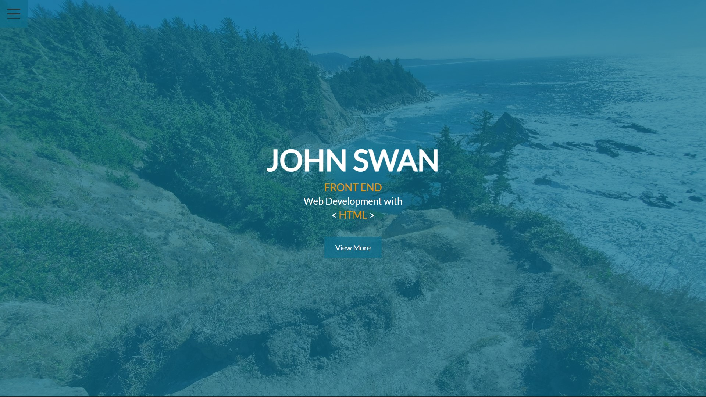

This was supposed to be my first portfolio. I liked the home screen and the animation to bring up the navbar, but the project kind of fell apart when I moved on to the other pages. At the time I just didn't have enough knowledge to finish this project and by the time I did I had given up on the design and moved onto a new one, which had the same fate.

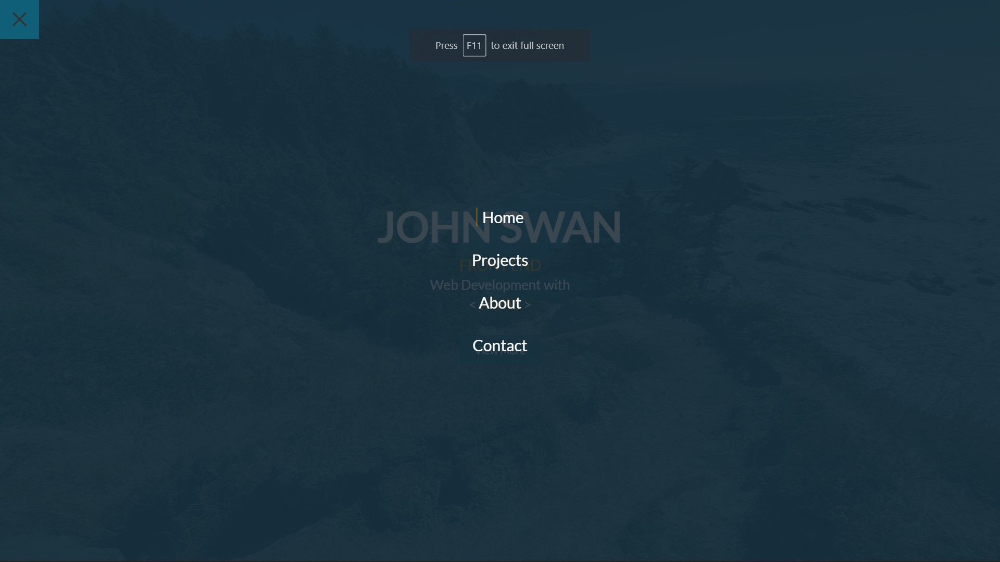

The navbar was fully responsive and made entirely with SCSS. When I built the website I had just become comfortable with SCSS and I felt like it was a massive improvement over CSS, but I still wasn't too comfortable with JavaScript.

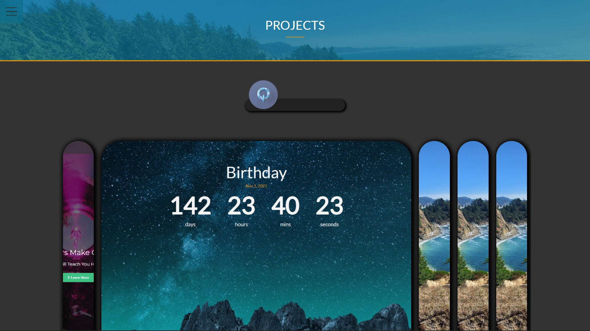

When I built the projects page I didn't have enough projects that I had built outside of Udemy courses, so some of the spots are blank, but I had a music player that played 3 songs from Harris Heller's "Stream Beats" (royalty-free music for Streamers/YouTubers) and the album art would spin in a circle with a progress bar for the song time and song name/artist.

There was also a built-in calendar page that would count down to my birthday. This was a separate page that made it look like a link to a new website. Again, this was one of my first projects.

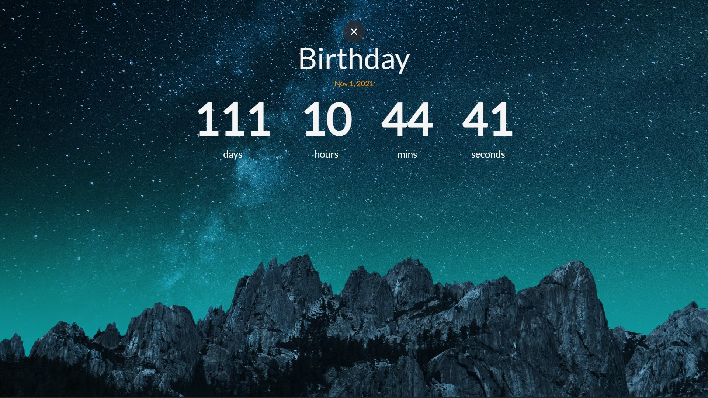

# portfolio_main
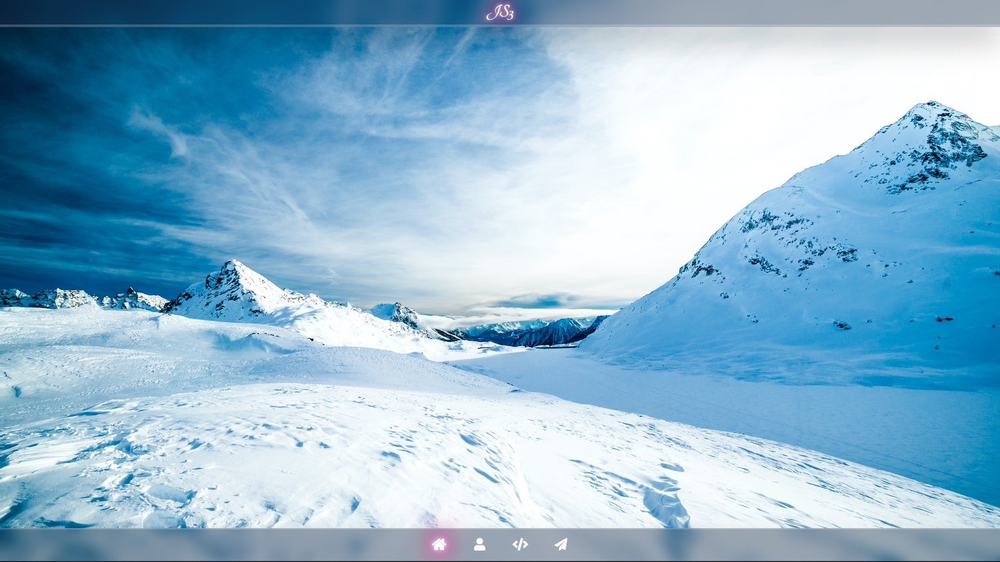
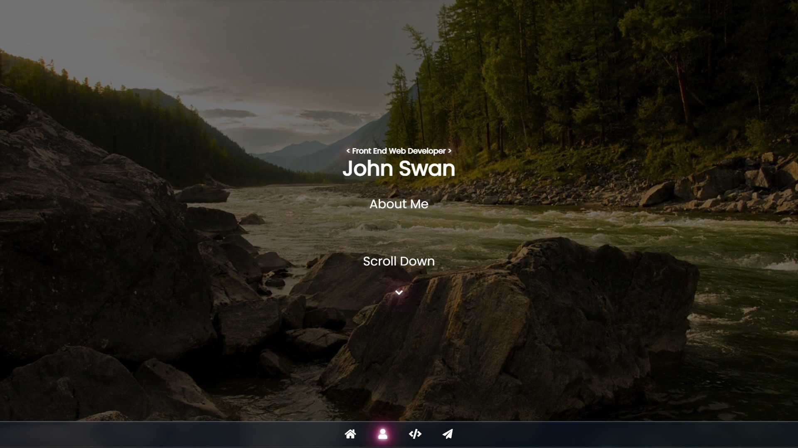
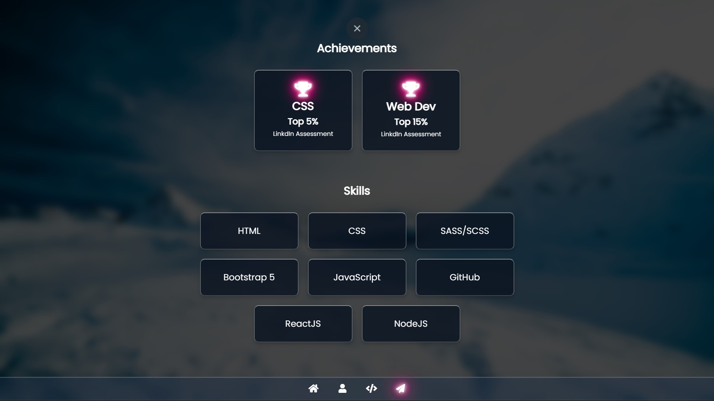
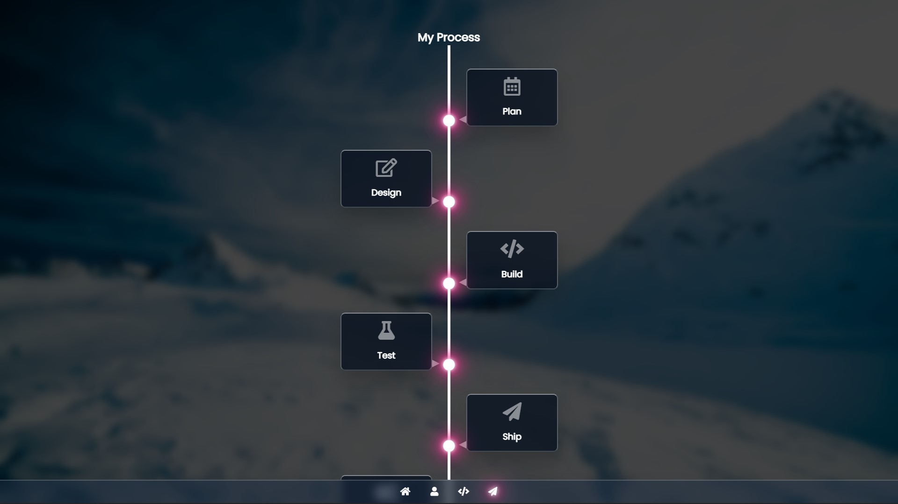
This version was inspired by Ubuntu/MacOS and Windows 11 (which was a leaked build at the time). This was the first project that I built with more advanced CSS effects like transparency, blur, and animated shadows to simulate a glowing effect. I think I overused the glowing a little now, but I would still like to go and explore this style of design more later now that I am much better.

An issue that I ran into was that this website would use a ton of CPU and GPU power. It would only happen when I would switch "pages", and I think that it is because I was hiding the home page and overlaying the entire new page with JavaScript. I didn't want any page loading when switching. I eventually did some research and found out I was trying to build a Single Page Application and that React or Vue would be a better option. This was one of my last projects without a framework.

When I was building this page I wanted to make sure that it worked well on phones so I built it in a small window and then scaled it up.

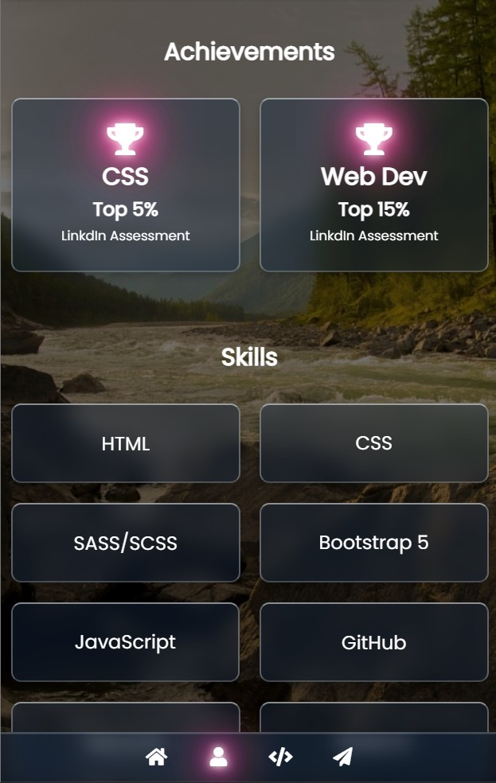

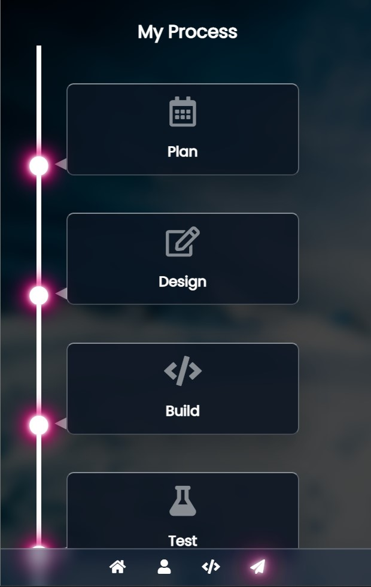

I built what is here when I was camping for a family reunion. I didn't have great phone service, so I had to rely on what I knew and my notes, and I was very happy with what I had accomplished at the time and it boosted my confidence to continue doing web development.

I believe that I had been seriously learning for a little over 2 months at this point. 

## portfolio_v4
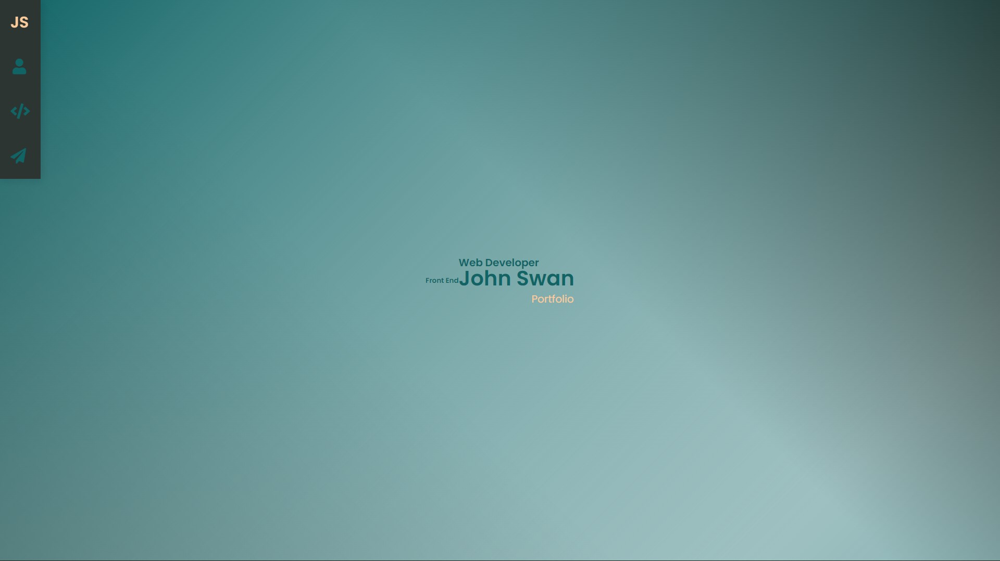

This project was never meant to be a serious portfolio. I was building it while learning React and wanted something to experiment with JQuery, gradients, glassmorphism, different input boxes, text positioning and different navbar styles. I forgot about this project but now that I am looking at it I think that this design has some potential.

The entire background is one gradient and as you navigate through the page the gradient gets darker. I found some color schemes online and based this off of them and I still like the themeing of it, it just needs some tweaks.

Navigation uses smooth-scrolling written in JQuery.

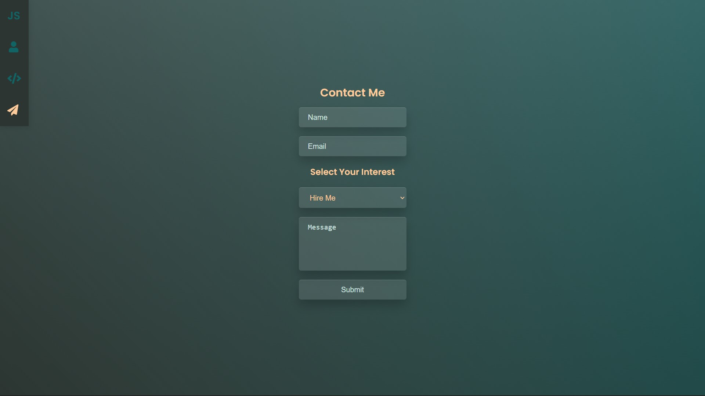